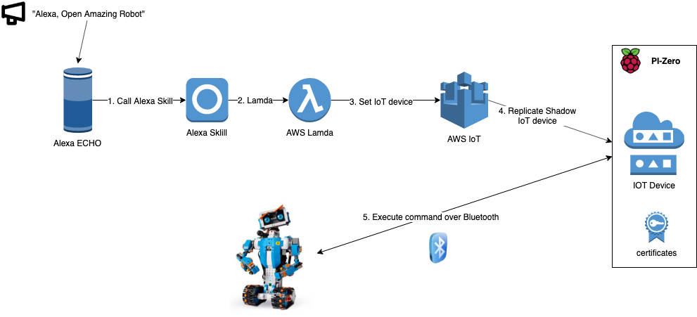

# Legoboostrobot
A project using an Alexa powered device to control a [Lego Boots Robot](https://www.lego.com/en-gb/product/boost-creative-toolbox-17101). The Lego Boots robot is connected to Raspberry PI Zero using Bluetooth. Raspberry PI Zero is connected to the Internet.

# Hardware & Service requirements
- [Lego Boots Robot](https://www.lego.com/en-gb/product/boost-creative-toolbox-17101)
- Raspberry PI Zero or other device that can run node and is connected to the internet.
- AWS Account

# Installation instructions
1. Create new folder called "certs" in the root and store the generated a certificate, public key, and private key using AWS IoT's certificate authority in AWS IoT Things page.

2. Create a new file config.json in the root directory with following values and run npm install
```
{
  "keyPath": "./certs/<Enter the name of the file generated in previous step>.key",
  "certPath": "./certs/<Enter the name of the file generated in previous step>.crt",
  "caPath": "./certs/<Enter the name of the file generated in previous step>.pem",
  "SHADOWID": "PiZeroRobotHub",
  "host": "<host for the device>"
}
```

3. Create a new file config.json in the lambda/code with following values
```
{
  "endpoint": "<host for the device>"
}
```

4. Create a lambda with Alexa Skills Kit & AWS IoT using the code in folder lambda/code (don't forget to run npm install)

5. Create new skill using the json file stored in the folder "Alexa" and point endpoint to the Lambda created in the previous step.

# Running instructions
1. On your Raspberry PI run the commmand
```npm index.js```
2. Say "Alexa. Open Amazing Robot" and follow the instructions.

# Alexa example commands
- Connect
- Set the light to red
- Change color to red
- please can you spinner
- have a go at the driveroutine
- please can you drivesquary
- have a go at the shakinghead

# Solution Architecture


